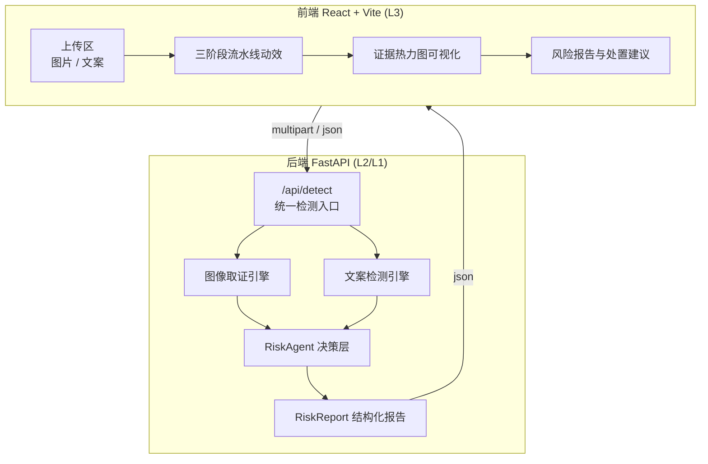

# 02 · 技术架构设计

---

## 一、整体架构



## 二、模块职责

| 模块 | 文件 | 职责 | 依赖 |
| --- | --- | --- | --- |
| 服务入口 | `backend/app/main.py` | FastAPI 应用、路由、CORS、异常处理 | fastapi, uvicorn |
| 数据契约 | `backend/app/schemas.py` | 请求/响应模型（前后端唯一真相源） | pydantic |
| 图像取证 | `backend/app/detection/image_forensics.py` | ELA、噪声一致性、EXIF/元数据、重压缩分析，输出热力图 base64 | opencv, pillow, numpy |
| 视觉语义 | `backend/app/detection/llm_vision.py` | 调用多模态大模型做语义级真伪判断 | openai sdk |
| 文案检测 | `backend/app/detection/text_detector.py` | 规则库命中 + LLM 语义判定虚假宣传 | openai sdk |
| Agent 决策 | `backend/app/agent/risk_agent.py` | 证据聚合、风险分级、处置建议、理由生成 | openai sdk（可降级为规则） |

---

## 三、核心数据契约（`RiskReport`）

前后端唯一共享的结构，定义在 `backend/app/schemas.py`：

```python
class Evidence(BaseModel):
    source: str          # "forensics" | "vision_llm" | "text_rule" | "text_llm"
    name: str            # 证据名：如 "ELA 局部误差异常"
    score: float         # 0~1，越高越可疑
    weight: float        # 该证据在聚合中的权重
    description: str     # 人话解释
    region: list[float] | None = None  # [x, y, w, h] 归一化坐标，用于热力图定位

class RiskReport(BaseModel):
    risk_level: Literal["low", "medium", "high"]
    risk_score: float                  # 0~100
    image_evidence: list[Evidence]
    text_evidence: list[Evidence]
    heatmap: str | None = None         # base64 PNG，叠加在原图上
    reasoning: str                     # Agent 推理说明
    action: Literal["pass", "review", "flag", "takedown"]
    suggestions: list[str]             # 面向不同角色的处置建议
    degraded: bool = False             # 是否因 LLM 不可用而降级
```

---

## 四、图像取证算法细节（硬证据）

### 4.1 ELA（Error Level Analysis，误差级别分析）
1. 用 Pillow 以 JPEG quality=90 重新压缩原图
2. 与原图逐像素求差，取绝对值放大
3. 分块统计误差均值：篡改区域因经过二次编辑，压缩误差显著高于周围
4. 归一化生成热力图（青→黄→红）

### 4.2 噪声一致性分析
- 用 OpenCV 估计图像高频残差噪声图
- 分块计算噪声方差，方差差异过大的块判为"拼接/外来区域"

### 4.3 EXIF / 元数据检查
- 缺失拍摄参数（相机型号、拍摄时间）→ 多为二次编辑或 AIGC
- 存在编辑软件痕迹（如 Photoshop、GIMP 标记）→ 直接命中
- PNG 却带 JPEG 压缩特征 / 双重量化痕迹 → 可疑

### 4.4 分数合成
```
image_score = 0.45 * ela + 0.30 * noise + 0.25 * metadata
```

---

## 五、文案检测（软证据）

### 5.1 规则层（美妆垂类知识库）
分类检测项，命中即产出证据：

| 类别 | 示例词/模式 | 严重度 |
| --- | --- | --- |
| 绝对化用语 | 100%、永久、第一、最、顶级 | 中 |
| 医疗功效 | 治疗、抗炎、祛痘、医美级、替代激光、药用 | 高 |
| 时限承诺 | 七天美白、一夜回春、28天逆龄、立竿见影 | 高 |
| 伪造背书 | 虚构检测机构、编造专利号、"权威认证"无来源 | 高 |
| 编造体验 | 无具体描述却强烈推荐、前后矛盾的使用感受 | 中 |

### 5.2 LLM 语义层
Prompt 要求模型输出结构化 JSON：命中类别、理由、置信度、修改建议。
**规则命中优先**，LLM 用于发现规则库覆盖不到的隐性夸大与编造痕迹。

---

## 六、Agent 决策逻辑（L2）

### 6.1 输入聚合
```
total = Σ(evidence.score × evidence.weight) / Σ(evidence.weight)
```
权重设计（可调，写入配置文件）：

| 证据来源 | 权重 | 理由 |
| --- | --- | --- |
| ELA 异常 | 0.25 | 客观但易受压缩干扰 |
| 噪声不一致 | 0.15 | 定位拼接有效 |
| 元数据异常 | 0.10 | 强提示但不普适 |
| 视觉 LLM | 0.20 | 语义强、有幻觉风险 |
| 文案规则命中 | 0.15 | 合规红线，一票权重高 |
| 文案 LLM | 0.15 | 补充隐性风险 |

### 6.2 风险分级与处置映射

| 总分 | 等级 | 处置动作 | 建议 |
| --- | --- | --- | --- |
| < 30 | low | `pass` | 正常上架，留存记录 |
| 30 ~ 60 | medium | `review` | 转人工复核，标注可疑区域 |
| 60 ~ 80 | high | `flag` | 警示标记 + 限流 + 通知创作者修改 |
| > 80 或命中合规红线 | high | `takedown` | 建议下架 + 触发合规工单 |

**红线规则（优先级最高）**：命中"医疗功效宣称"或"伪造资质背书"→ 直接判 high + `takedown`，无视总分。这体现 Agent 的"业务规则优先于统计分数"。

### 6.3 理由生成
有 LLM → 让模型基于证据列表生成自然语言推理（受 JSON Schema 约束）。
无 LLM → 使用模板拼接：`"因检测到 {证据A}(置信度 {x}) 与 {证据B}，综合判定为 {等级}"`。

---

## 七、降级与容错

```
LLM 配置缺失 / 超时 / 报错
        ↓
degraded = True，仅保留本地取证 + 规则证据
        ↓
分数按剩余证据重新归一化，报告正常输出
```

保证：评委现场断网、Key 失效时演示依然完整。

---

## 八、性能与工程约束

| 项 | 约束 |
| --- | --- |
| 上传大小 | ≤ 10MB（环境变量可配） |
| 图像处理 | 先缩放到最长边 1024 再分析，避免大图阻塞 |
| LLM 超时 | 30s，超时即降级 |
| 并发 | FastAPI 异步路由，检测为 CPU 密集 → 用 `run_in_threadpool` 避免阻塞事件循环 |
| 部署 | 本地 `uvicorn` + `npm run dev`；决赛可容器化 |

---

## 九、目录与接口一览

| 接口 | 方法 | 入参 | 出参 |
| --- | --- | --- | --- |
| `/api/detect/image` | POST | 图片文件 | `RiskReport`（图像部分） |
| `/api/detect/text` | POST | `{ text }` | `RiskReport`（文案部分） |
| `/api/detect/full` | POST | 图片 + 文案 | 完整 `RiskReport`（演示主用） |
| `/api/health` | GET | - | `{ status, llm_enabled }` |
