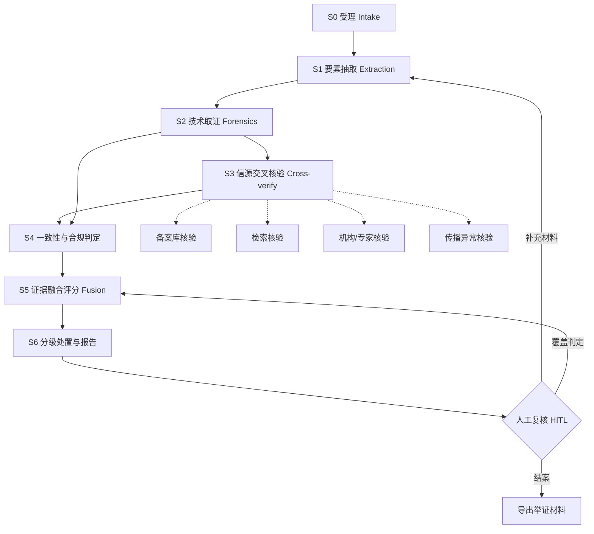

# 场景B · 美妆 GEO 伪造信源核验 Agent —— 工作流设计

## 一、场景与边界

**问题**：GEO（Generative Engine Optimization）场景下，美妆品牌通过伪造"专家背书""权威证书""检测报告""机构认证"污染网络语料，使生成式引擎在用户提问时推荐该品牌。品牌方与监管方需要判断：一张图片或一段文案，是否存在**伪造 GEO 信源**的可能。

**输入**：美妆图片（证书图、检测报告图、专家头像、产品对比图）和/或一段文案（功效宣称、专家/机构背书、数据引用、排名话术），可附来源 URL 与品牌/产品上下文。

**输出**：可举证的核验报告——四层结论 + 置信度 + 完整证据链 + 缺失材料清单 + 处置建议。

**边界（必须随结论一同呈现）**：

- 判定对象是**信源伪造风险**，不是产品质量优劣
- 不作司法终局定论，结论须经人工复核后使用
- 示例数据全部虚构，不指向任何真实主体

---

## 二、总体流程



编排方式与场景A 同构：`orchestrator` 以生成器逐步产出步骤事件，前端通过 SSE 实时渲染，最后产出完整结果对象。

---

## 三、节点定义（S0–S6）

### S0 受理 Intake

| 项 | 内容 |
| --- | --- |
| 输入 | 图片文件（可多张）、文案文本、来源 URL、品牌名、产品名 |
| 处理 | 图片落盘、计算哈希去重、读取尺寸与格式、文案长度与语言归一 |
| 产出 | `artifacts[]`：图片元信息（路径、哈希、尺寸、MIME） |
| 失败处理 | 图片损坏/格式不支持 → 记录为不可用素材，继续跑文案分支 |

### S1 要素抽取 Extraction

| 项 | 内容 |
| --- | --- |
| 输入 | S0 的 artifacts + 文案 |
| 图像侧 | 多模态模型 OCR + 结构化，抽取：证书编号、发证机构、获证主体、标准号、有效期、印章文字、检测项目、样品名称 |
| 文案侧 | 主张抽取：功效主张 / 数据主张 / 背书主张 / 排名主张 / 违禁用语；实体抽取：专家姓名、头衔、机构、证书编号、文献引用、备案号 |
| 产出 | `claims[]`（主张）、`entities[]`（实体） |
| 失败处理 | 模型不可用 → 降级为规则抽取（正则匹配编号格式、机构关键词、功效词表），并标记 `degraded` |

> LLM 只做**抽取与语义比对**，不做终局判定；判定全部由确定性规则产出，保证可复现、可举证。

### S2 技术取证 Forensics

不依赖外部信源的本地信号。**本期为占位节点**：返回空信号列表，评分模型保留权重槽位。

规划中的信号（后续补充）：ELA 错误级别分析、噪声/光照一致性、EXIF 与编辑软件残留、印章矢量痕迹、证书编号格式合法性、频谱特征、AI 生成痕迹。

### S3 信源交叉核验 Cross-verify（并行）

对 S1 抽出的每个实体并行发起核验，四类工具：

| 工具 | 核验对象 | 真实实现 | 无 Key 时 |
| --- | --- | --- | --- |
| 备案库核验 | 化妆品备案/注册号、产品名称、生产企业 | 药监局化妆品备案查询页抓取解析 | mock 虚构备案库 |
| 检索核验 | 机构是否真实存在、证书编号、文献引用、网络传播 | Tavily / 博查 / Bing 检索 API | mock 检索回放 |
| 机构与专家核验 | CMA/CNAS 资质、发证机构、专家执业与学术身份 | 检索 + 官网线索，标记需人工复核 | mock 专家/机构库 |
| 传播异常核验 | 同图同话术多平台批量复制（GEO 水军特征） | 检索 + 图片哈希比对 | mock 传播数据 |

并行度 4，单工具超时 15s，结果按 `工具+归一化查询` 缓存，失败降级不中断主流程。

### S4 一致性与合规判定

| 维度 | 判定内容 |
| --- | --- |
| 主体一致 | 证书获证主体 vs 品牌/生产企业是否一致 |
| 时间一致 | 证书有效期 vs 文案发布时间/背书时间 |
| 语义一致 | 证书核定范围 vs 文案功效宣称（超范围宣称） |
| 法规合规 | 禁用医疗用语（治疗、消炎、处方等）、功效宣称评价依据、特殊化妆品注册 vs 普通化妆品备案 |

产出 `findings[]`：每条含维度、结论、依据、严重度。

### S5 证据融合评分 Fusion

- 按权重表对每条证据做加/降信累加
- 命中红线 → 一票否决
- 输出四层结论 + 置信度 + 证据链

### S6 分级处置与报告

| 结论 | 处置建议 |
| --- | --- |
| 可核验（低风险） | 归档留痕，可正常对外宣称 |
| 存疑 | 转人工复核，要求补充材料 |
| 高度疑似伪造 | 建议下架/整改，输出举证材料 |
| 证据不足 | 列出缺失材料清单，待补料重跑 |

报告落盘 `data/cases/<case_id>.json`，可导出 JSON / Markdown 举证材料。

---

## 四、证据状态语义（核心，防误报的设计）

| 状态 | 含义 | 对结论的影响 |
| --- | --- | --- |
| `CONFIRMED` 证实 | 信源存在且与声明一致 | 增信 |
| `CONTRADICTED` 冲突 | 信源存在但与声明冲突（如备案号对应另一家企业） | **强降信**，可能的红线 |
| `NOT_FOUND` 查无 | 官方库/检索中未找到 | **不等于伪造**，仅记入缺失材料清单 |
| `UNVERIFIABLE` 不可验 | 工具超时/失败/无可用信源 | 标记 `degraded`，转人工复核，不影响风险分 |

**这条区分是本场景防误报的关键**：把"查不到"当"造假"是同类系统最大的误报来源。

---

## 五、证据权重表

| 证据类型 | 极性 | 权重 | 说明 |
| --- | --- | --- | --- |
| 备案号在官方库且主体一致 | 增信 | +3 | |
| 机构资质真实且编号可查 | 增信 | +3 | |
| 专家身份可核验且任职期匹配 | 增信 | +2 | |
| 证书编号格式合法 | 增信 | +1 | |
| 备案号对应主体与宣称品牌不一致 | 降信 | −5 | 红线候选 |
| 发证机构在资质库中不存在 | 降信 | −4 | 红线候选 |
| 专家身份无任何公开痕迹 | 降信 | −3 | 需人工确认 |
| 证书已过期/有效期不覆盖宣称时间 | 降信 | −3 | |
| 功效宣称超出证书核定范围 | 降信 | −3 | 超范围宣称 |
| 使用禁用医疗用语 | 降信 | −4 | 红线候选 |
| 特殊功效无注册/评价依据 | 降信 | −3 | |
| 同图同话术多平台批量复制 | 降信 | −2 | GEO 水军特征 |
| 数据引用无对应文献 | 降信 | −2 | |
| 技术取证异常（ELA/EXIF/AI 痕迹） | 降信 | 0（本期占位） | 权重槽位保留，后续启用 |

## 六、红线规则（命中即一票否决）

1. 证书编号在发证机构库中 `CONTRADICTED`（查有此号但主体不符）
2. 发证机构在 CMA/CNAS 等资质库中确认不存在
3. 备案号在药监局库中 `CONTRADICTED`
4. 文案出现禁用医疗用语且作为核心功效宣称
5. 专家身份与宣称机构 `CONTRADICTED`（如三甲医院查无此人）

命中任一红线 → 结论直接判为**高度疑似伪造**，置信度拉满，并在报告中列出红线依据。

---

## 七、四层结论与阈值

| 结论 | 触发条件 | 置信度 |
| --- | --- | --- |
| 高度疑似伪造 | 命中任一红线，或风险分 ≥ 8 | 高 |
| 存疑 | 风险分 4 ~ 7 | 中 |
| 证据不足 | 有效证据条数 < 3，或不可验工具占比 > 50% | 低 |
| 可核验（低风险） | 风险分 < 4 且有效证据 ≥ 3 且无红线 | 中-高 |

阈值外置在 `backend/config/thresholds.yaml`，改配置不改代码。

---

## 八、数据结构

```jsonc
{
  "case_id": "case_xxx",
  "input": {
    "images": [{"name": "cert.jpg", "path": "...", "sha256": "...", "width": 1200, "height": 800}],
    "text": "三甲医院皮肤科主任推荐，临床验证有效率 98%……",
    "source_url": "https://...",
    "brand": "虚构品牌",
    "product": "虚构产品"
  },
  "claims": [
    {"type": "endorsement", "text": "三甲医院皮肤科主任推荐", "entities": ["某三甲医院", "皮肤科主任"]},
    {"type": "efficacy", "text": "临床验证有效率 98%", "entities": ["98%"]}
  ],
  "evidences": [
    {
      "tool": "institution",
      "query": "某三甲医院 皮肤科主任 XX",
      "status": "contradicted",       // confirmed | contradicted | not_found | unverifiable
      "polarity": "down",             // up | down | note
      "weight": -3,
      "summary": "该院皮肤科公开在职名单中查无此人",
      "source_url": "https://...",
      "captured_at": "2026-10-06T12:00:00Z",
      "degraded": false,
      "needs_human_review": false,
      "elapsed_ms": 1420
    }
  ],
  "findings": [
    {"dimension": "主体一致", "ok": false, "detail": "证书获证主体为 A 公司，宣称品牌为 B", "severity": "high"}
  ],
  "verdict": {
    "level": "highly_suspected",      // verifiable | doubtful | highly_suspected | insufficient
    "level_cn": "高度疑似伪造",
    "risk_score": 9,
    "confidence": 0.92,
    "fired_redline": "专家身份与宣称机构冲突",
    "reason": "命中红线：专家身份与宣称机构冲突"
  },
  "report": {
    "missing_materials": ["证书原件高清扫描件", "检测机构资质证明"],
    "action": "建议下架并整改对外宣称",
    "disclaimer": "本结论为信源伪造风险研判，不作司法终局定论"
  }
}
```

---

## 九、工具适配层

统一契约，mock 与 real 实现可互换：

```python
class EvidenceStatus(str, Enum):
    CONFIRMED = "confirmed"
    CONTRADICTED = "contradicted"
    NOT_FOUND = "not_found"
    UNVERIFIABLE = "unverifiable"

@dataclass
class ToolResult:
    tool: str
    query: str
    status: EvidenceStatus
    summary: str
    confidence: float
    source_url: str | None
    degraded: bool = False
    needs_human_review: bool = False
    elapsed_ms: int = 0
```

| 工具 | mock 实现 | real 实现 | 降级策略 |
| --- | --- | --- | --- |
| `llm_vision` | 读取 `data/seed/fixtures/vision.json` 回放 | openai SDK + DashScope 兼容端点（`qwen-vl-max-latest`） | 解析失败重试 1 次后降级 |
| `search` | 内置检索回放库 | Tavily HTTP API（httpx 直连） | 超时/无 Key → `unverifiable` |
| `nmpa` | 虚构备案库 | 药监局备案查询页抓取 + 解析 | 抓取失败 → `unverifiable` + 需人工复核 |
| `institution` | 虚构机构/专家库 | 检索 + 官网线索 | 同上 |

模式选择：未配置任何 Key → 全 mock；配置 Key → real；real 失败 → 单工具降级，主流程不中断。

---

## 十、案例走查（全部虚构）

### 案例1 · 伪造 CMA 检测报告 + 三甲主任推荐

- **输入**：一张检测报告图（含 CMA 标志、编号 `CMA-2025-XX-1234`）+ 文案"三甲医院皮肤科主任推荐，临床验证有效率 98%"
- **S1**：抽出证书编号、发证机构、功效数据主张、专家背书主张
- **S3**：备案库核验 → 编号 `CONTRADICTED`（该号对应另一主体）；机构核验 → 专家在该院名单中查无
- **S4**：语义一致 → "有效率 98%" 属功效宣称但无评价依据；合规 → 无医疗用语
- **S5**：命中红线 1、5 → **高度疑似伪造**

### 案例2 · AI 生成专家头像 + 虚构协会认证

- **输入**：专家头像图 + 文案"亚太美妆研究院首席研究员""亚洲美妆科技协会认证"
- **S3**：机构检索 → 该协会 `NOT_FOUND`；专家检索 → `NOT_FOUND`
- **S5**：两次 `NOT_FOUND` 计中等降信，但因无 `CONTRADICTED` → **存疑**，转人工
- **说明**：此例体现 `NOT_FOUND ≠ 伪造` —— 系统不会据此直接判伪

### 案例3 · 真实备案但超范围宣称

- **输入**：真实存在的备案号 + 文案"医美级淡斑，7 天根除色斑"
- **S3**：备案核验 → `CONFIRMED`（主体一致）
- **S4**：语义一致 → 备案范围为"保湿"，宣称"淡斑"属超范围；合规 → "根除"涉医疗化断言
- **S5**：风险分 6 → **存疑**，处置为"整改宣称用语"

---

## 十一、已知局限

| 局限 | 影响 | 缓解 |
| --- | --- | --- |
| 官方库无开放 API，依赖网页抓取 | 稳定性差、可能失败 | 失败一律 `unverifiable`，转人工复核，不影响风险分 |
| 专家身份核验依赖公开信息 | 基层/非公开专家易 `NOT_FOUND` | 与 `CONTRADICTED` 严格区分，不据此判伪 |
| 技术取证本期为空 | 缺少图像篡改类证据 | 节点与权重槽位已保留，后续启用 |
| AI 生成图像检测准确率有限 | 可能漏检高质量生成图 | 结论只给风险等级，不明确断言"AI 生成" |
| 多模态模型抽取可能出错 | 要素抽取错误传导 | 抽取结果在报告中展示，支持人工覆盖 |
