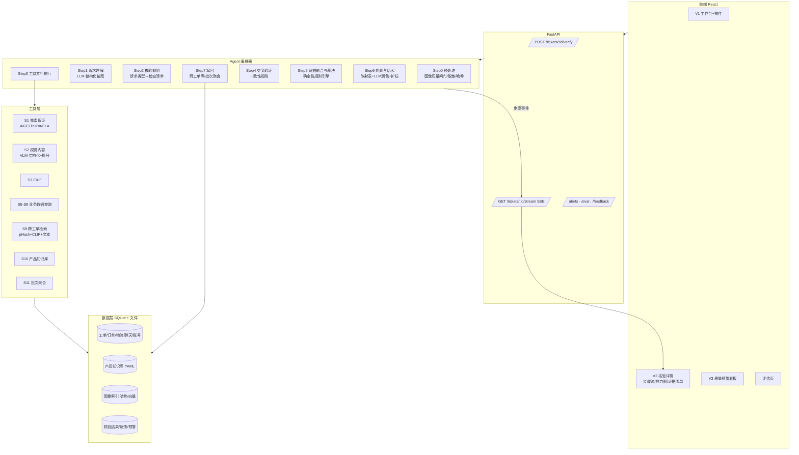

# 场景 A 技术方案：售后客诉证据鉴真 Agent

> 版本：v0.1（2026-10-06）｜ 对应需求：`docs/需求分析-场景A.md` v0.2
> 设计原则：**实施难度 × 效果** 双约束——距初赛提交（10/20）约 14 天，按"一人主力可完成"规划；每个模块给出**主方案 + 降级方案**。

---

## 0. 结论先行

| 决策 | 选择 | 理由 |
| --- | --- | --- |
| 总体范式 | **"模型只感知，规则来裁决，LLM 来表达"** | 误报率最优先 → 裁决必须确定、可测、可解释；参考 ProofLens / ClaimLens |
| Agent 形态 | **诉求驱动的规划 + 并行工具调用 + 交叉验证 + 确定性裁决** | 满足"Agent 识别→决策闭环"，又不让 LLM 自由拍板 |
| 编排框架 | **自研轻量编排器**（~300 行，typed state + 步骤事件流） | LangGraph 学习/调试成本高；我们的图是固定 DAG，不需要动态循环 |
| 视觉模型 | **通用多模态大模型（VLM）为主**，专用取证模型为辅 | VLM 一个模型覆盖内容识别、OCR、物理合理性；取证专用模型只做"像素痕迹"一件事 |
| 像素取证 | AIGC 检测（Community Forensics，CPU 可跑）+ 篡改定位（TruFor，需 GPU，可选）+ ELA 兜底 | 不押单一检测器；检测器结果只算"需印证的强信号" |
| 跨工单 | pHash（同图）+ CLIP 向量（近似图） | 成熟、CPU 即可、阈值有公开经验值 |
| 数据层 | SQLite + JSON 种子数据 | 模拟订单/物流/账号/批次，零运维 |
| 后端 / 前端 | FastAPI + SSE ｜ React + Vite + Tailwind + shadcn/ui + Recharts | 沿用旧版栈，SSE 推送 Agent 步骤用于 V2 过程展示 |
| 模型接入 | OpenAI 兼容协议 + 能力路由 + 逐级降级到 Mock | 不绑定厂商（不强制阿里）；无 Key 也能完整演示 |

---

## 1. GitHub 参考调研

### 1.1 直接同类：售后/理赔"照片 + 诉求 → 裁决"Agent

| 项目 | 做什么 | 我们借鉴 | 不照搬 |
| --- | --- | --- | --- |
| [ProofLens](https://github.com/Pranavsingh431/ProofLens) | 车/电脑/包裹损坏理赔核验，10 组件多 Agent 流水线 | ① **VLM 只回答"图里看到了什么"，从不回答"诉求是否成立"**；② 融合与裁决是纯 Python 规则；③ 账号历史**只写 risk_flags，不改结论**；④ 先查"证据标准"再看图；⑤ OpenCV 前置质量闸门（模糊/损坏图不进 VLM）；⑥ 审计 Agent 做一致性校验、定向重跑；⑦ SSE 逐步推送到前端 | 只看图，无订单/物流/跨工单 |
| [ClaimLens](https://github.com/anshulixyz/claimlens) | 一张照片 → accept / decline / needs-info，人在环 | ① **分层级联**：免费 CV → 便宜 VLM 感知 → 强模型裁判；② **fail-closed 到"信息不足"**而非"通过"；③ pHash 复用检测、图中文字/提示注入检测、CLIP 物体一致性；④ **能力路由 + Provider A→B→Mock 降级**；⑤ 结果按内容哈希缓存；⑥ `manual_review_required` 是正常输出而非错误 | 有 decline，我们禁止 AI 拒绝 |
| [ClaimsForge](https://github.com/zhenyueD/claimsforge) | 电商售后 6 Agent（意图/情绪/需求/损坏视觉/补偿/校验） | ① 编排器**不用 LangChain，单文件 ~220 行**；② Verifier 对话术做语气复核；③ 已处理案例回流作为先例 | 侧重补偿谈判，不做鉴伪 |
| [return-fraud-detection-system](https://github.com/rajudandigam/Ultimate-TypeScript-Real-World-AI-Projects/tree/main/projects/ecommerce/return-fraud-detection-system) | 退货欺诈工作流设计 | ① **LLM 只基于结构化事实 JSON 写说明，不做数值评分**；② 工具缺失时"显式不确定"，不猜欺诈；③ 以"可执行阈值下的精确率 / 误报率"为核心指标 | 纯设计文档 |

### 1.2 Agent 架构参考

| 项目 | 借鉴 |
| --- | --- |
| [roberteisenberg/langgraph 欺诈调查教程](https://github.com/roberteisenberg/langgraph) | 核心结论："**LLM 负责调查，Python 负责打分，框架负责循环**"；证据结构化累积 → 确定性评分 → 中间区间转人工。并演示了"老客户 + 多个弱信号"的典型误判场景 |
| [langgraph-supervisor-agents](https://github.com/girijesh-ai/langgraph-supervisor-agents) | ① 专家并行 → **确定性聚合器** → 合成 LLM 只读聚合后的文本；② 提取 LLM 只读工具输出，防数值幻觉；③ **某工具失败则置信度按步长下调** |
| [Multi_Agent_Fraud_Detection](https://github.com/Sajjad-Shahali/Multi_Agent_Fraud_Detection) | 明确的硬阈值裁决表 + **短路规则**（强确定证据直接跳过后续 LLM，省成本）。注意它是"漏报代价更高"，我们相反 |

### 1.3 能力组件

| 能力 | 候选 | 结论 |
| --- | --- | --- |
| 篡改定位 | [TruFor](https://github.com/grip-unina/TruFor)（CVPR'23） | 输出**定位热力图 + 整图完整性分 + 可靠性图**，可靠性图专门用于压制误报，与我们"误报优先"高度契合。需 GPU 才实用；许可偏学术用途，需核对。**列为可选增强** |
| AIGC 检测 | [Community Forensics](https://github.com/JeongsooP/Community-Forensics)（CVPR'25，MIT，HF 有 224/384 权重） | 4803 个生成器训练，泛化在开源里较好；ViT 小模型 CPU 可推理。**列为主方案** |
| AIGC 检测 | [AIDE](https://github.com/shilinyan99/aide)（ICLR'25） | 其 Chameleon 实验表明：**多数检测器会把高质量 AI 图判为真** → 印证"不能只靠检测器" |
| 可解释鉴伪大模型 | [FakeShield](https://github.com/zhipeixu/FakeShield)（ICLR'25）/ [SIDA](https://github.com/hzlsaber/SIDA)（CVPR'25） | 13B~22B 权重，需大显存，14 天内不现实。**只借鉴其解释维度**（光照、边缘、分辨率、阴影不一致）写进 VLM 提示词 |
| 同图/近似图 | [imagededup](https://github.com/idealo/imagededup)、ImageHash、thorn perception | pHash 64 位默认汉明距离 ≤10 视为重复；thorn 建议 pHash(hash_size=16) 阈值 0.2，误报 <1% |
| 批号 OCR | PaddleOCR | 官方"包装生产日期"案例：PP-OCRv3 直接用于点阵字仅 **62.99%**，需微调到 87%。**不值得投入** → 用 VLM 读批号，PaddleOCR 不做 |

### 1.4 调研得出的 5 条设计铁律

1. **VLM 只描述，不裁决**（ProofLens、return-fraud）。
2. **裁决是确定性规则**，可单测、可复现、可解释（LangGraph 教程、ProofLens）。
3. **弱信号只能加标记，不能改结论**（ProofLens 的 history 设计 = 我们的 S8 定位）。
4. **不确定时退回"需补充凭证"**，而不是"可疑"（ClaimLens fail-closed）。
5. **任何模型失败都要降级，不中断**（ClaimLens 路由、supervisor 置信度下调）。

---

## 2. 总体架构



---

## 3. Agent 流程详解

### Step 0 预处理（纯 CV，0 成本）
- **质量闸门**：Laplacian 方差判模糊、亮度直方图判过暗/过曝、分辨率过低 → 标记 `quality_issue`，后续直接走"需补拍"，**不进入取证**（避免模糊图被误判，对应需求 N3）。
- **脱敏**：人脸检测（OpenCV DNN / mediapipe）打码后才送外部 VLM；手机号、地址文本掩码。
- **指纹**：SHA256（缓存键）+ pHash + CLIP 向量。
- **截图识别**：长宽比 + 顶部状态栏特征 → `is_screenshot`，取证结果降权。

### Step 1 诉求理解（LLM，便宜模型）
输入售后类型、原因、描述、聊天片段 → 输出 JSON：
```json
{"issue_type":"leak","part":"pump","severity":"moderate",
 "claimed_items":1,"time_hint":"on_arrival",
 "chat_first_reason":"不喜欢味道","is_health_claim":false}
```
- `issue_type` 枚举：`outer_box_damage / container_crack / pump_broken / leak / missing_item / wrong_item / quality / allergy / other`
- 正则快路径 + LLM 兜底（ProofLens 做法，省 ~50% 调用）。
- `is_health_claim=true` → 直接走健康流程（需求 7.4），只整理凭证。

### Step 2 核验规划（规则表，可展示为 Agent "思考"）
诉求类型决定启用哪些检查，而不是每单都跑全量：

| 诉求 | 必查 | 选查 |
| --- | --- | --- |
| 漏液 | S1 液体区域、S2 液体性状、S10 液体颜色/质地、S7 | S9、S11 |
| 瓶身/泵头破损 | S1 破损区域、S2 破损形态、S10 易损部位与可能性 | S7、S9 |
| 外盒压损 | S2、S7 轨迹异常 | S11 线路 |
| 错发/规格不符 | S2 品名规格批号、S6 | — |
| 少件 | S6、S2 件数 | S7 重量（如有） |

前端 V2 把这一步渲染为"Agent 决定先查 X，因为诉求是 Y"。

### Step 3 工具并行执行
`asyncio.gather` 并发，每个工具返回统一的 `Evidence[]`，失败返回 `ToolError` 而非抛异常。

### Step 4 交叉验证（规则 + 少量 LLM 比对）
| 规则 | 输入 | 产出 |
| --- | --- | --- |
| X1 篡改×诉求相关性 | S1 可疑区域 bbox × S2 诉求部位 bbox，IoU | 重叠 → 强降信；不重叠 → 备注"无关编辑" |
| X2 图×订单 | S2 品名/规格/件数 × S6 | 不符 → C1 |
| X3 诉求×图 | S4 issue × S2 观察到的问题 | 看不到 → C2 |
| X4 诉求×产品 | S4 issue × S10 容器可能损坏方式矩阵 | 不可能 → C3 |
| X5 时间线 | S3 拍摄时间 × S7 签收；申请时间 − 签收时间 | 矛盾 → C4 |
| X6 前后说法 | S5 首次原因 × S4 申请原因（LLM 判语义是否一致） | 变向易获赔原因 → C5 |
| X7 增信 | S7 轨迹破损、S11 同批可信投诉、S10 破损形态典型 | 增信项 |

### Step 5 证据融合与裁决（确定性，核心）
每条证据统一结构：
```json
{"id":"E3","source":"S1","polarity":"down","strength":"strong",
 "claim_relevant":true,"confidence":0.82,
 "locator":{"image":"img_1","bbox":[120,340,260,420]},
 "summary":"漏液区域存在局部重绘痕迹","raw":{...}}
```
裁决规则（直接实现需求 7.2，按顺序短路）：

```
R0 健康类                                     → 转专人
R1 图片质量不合格 或 关键信息缺失              → 存疑-信息不足（补拍）
R2 强降信(claim_relevant) ≥1 且 其他降信 ≥1    → 高风险
   特例：S9 同图多单（精确 pHash 命中）单独即可 → 高风险
R3 强降信 ≥1 但无印证                          → 存疑-有疑点
R4 中降信 ≥2                                   → 存疑-有疑点
R5 其余（含仅弱信号）                          → 可信
增信抵消：强增信可将 R3/R4 下调一级；R2 不被抵消，只附注
弱信号（S3/S8）：只进入 flags，不参与 R2~R4 计数
```
- 阈值（各检测器 score → strength 的映射）放 `config/thresholds.yaml`，**用数据集校准，目标：误报率 ≤10% 前提下拦截率最大**。
- 输出同时给 `confidence`（参与证据的平均置信度，工具失败按 0.2 递减），低于阈值强制降为"存疑-信息不足"。

### Step 6 处置与话术
- 结论 → 处置：**查表**（需求 8.1），不经 LLM。
- 补拍要求：按触发规则查表（需求 8.2），多疑点合并为最多 2 条要求。
- 话术：模板 + LLM 润色；**护栏**：禁用词表（怀疑/造假/伪造/风险/P图/骗…）命中则回退模板；V1 插件中客服可编辑。
- 证据包：结论、证据清单、标注图、关联工单 → 导出 HTML/PDF（Should）。

### Step 7 写回
- 图像指纹入 S9 索引；结论入批次聚合表（只把"可信"计入质量预警统计）。
- 反馈接口 `/feedback`：客服采纳/修改、验收结果 → 存 `feedback` 表，评估页与阈值校准使用。

---

## 4. 各信息源技术选型

| 源 | 主方案 | 降级方案 | 难度 | 效果 | 备注 |
| --- | --- | --- | --- | --- | --- |
| **S1 像素** | ① Community Forensics（AIGC 概率，CPU）② TruFor（定位热力图，GPU 可选）③ VLM 物理合理性审视（高光/阴影/液体形态/文字畸变） | ELA + 噪声一致性（旧代码复用） | 中 | 中 | 检测器分数一律视为"需印证"；截图/重压缩自动降权 |
| **S2 内容** | VLM 结构化抽取：品牌、品名、规格、容器、破损部位+bbox、液体颜色、批号文字、是否与面单同框 | 换另一家 VLM；再失败 → 该源缺失 | 低 | **高** | 核心信息源，提示词需精调；要求返回 bbox 以便 X1 |
| **S3 EXIF** | Pillow/piexif | — | 低 | 低 | 缺失不计；有且矛盾才算弱证据 |
| **S4 诉求** | 正则 + LLM 抽取 | 仅正则 | 低 | 中 | |
| **S5 聊天** | LLM 判"首次原因 vs 申请原因"语义一致性 | 关键词规则 | 低 | 中 | |
| **S6 订单** | SQL 查询 + 字段比对 | — | 低 | **高** | 规格/品名不符是最"可解释"的证据 |
| **S7 物流** | SQL：轨迹异常节点、签收-申请间隔、线路破损率 | — | 低 | 中 | 主要用于增信 |
| **S8 账号** | SQL：近 90 天售后次数/仅退款占比/注册时长/消费额 | — | 低 | 低 | 只进 flags |
| **S9 跨工单** | pHash(16) 精确同图 + CLIP(ViT-B/32 或 Chinese-CLIP) 余弦近似图 + 诉求文本字符 n-gram 相似 | 仅 pHash | 低 | **高** | 演示效果极直观（并排展示关联工单） |
| **S10 知识库** | YAML 每 SKU：容器/开口/规格/易损部位/可能损坏矩阵/液体性状/参考图 | — | 中（整理工作量） | **高** | "懂美妆"差异化来源；VLM 可对比参考图 |
| **S11 批次** | SQL 聚合 + 基线比较（近 7 天 vs 前 28 天均值，泊松上尾 p<0.01 或 ≥3 倍且 ≥N 单） | 固定阈值 | 低 | 中 | 同时服务 V3 预警 |
| **S12 新证据** | 补拍图复用全流程；验收结果写 feedback | — | 低 | 中 | 评估页展示"回流校准" |

> 难度/效果对比后的取舍：**S2、S6、S9、S10 是性价比最高的四个源**，优先打磨；S1 不追求 SOTA，追求"稳 + 可视化"。

---

## 5. 模型选型与路由

### 5.1 能力需求 → 模型档位
| 档位 | 用途 | 候选（任选其一，均走 OpenAI 兼容协议） |
| --- | --- | --- |
| VLM-强 | S2 结构化识别、S1 物理合理性、批号读取 | Qwen-VL-Max / Qwen2.5-VL-72B、GPT-4o、Gemini 2.5、GLM-4V |
| LLM-便宜 | S4/S5 抽取、话术润色、说明撰写 | Qwen-Turbo/Plus、DeepSeek-V3、GPT-4o-mini |
| 本地小模型 | AIGC 检测、CLIP 向量、人脸检测 | Community Forensics、open_clip、OpenCV DNN |

### 5.2 路由与降级
```
provider 列表(按配置优先级) → 调用 → 失败/超时 → 下一个 → 全失败 → Mock（返回"该源不可用"）
```
- 所有 VLM/LLM 调用：**JSON Schema 约束输出**，字段枚举化，非法值吸附到 `unknown`（ClaimLens "schema-as-law"）。
- **按 (图像SHA256, prompt版本) 缓存**：重复演示零成本、结果稳定。
- 每次调用记录 tokens 与费用 → 单工单成本展示（需求 11.2）。

### 5.3 提示词要点（S2）
- 只问"看到了什么"：产品、规格文字、破损部位、液体颜色/质地、是否有面单；**不问"是否造假"**。
- S1 物理合理性单独一次调用，借鉴 FakeShield/SIDA 维度：光照方向、边缘、局部分辨率、阴影、液体流动形态、印刷文字是否畸变；要求逐项给"观察 + 置信度 + bbox"。

---

## 6. 数据设计

### 6.1 目录
```
data/
  seed/
    products.yaml        # S10 产品知识库（5~10 SKU）
    tickets.jsonl        # 工单 + 真值标注
    orders.jsonl  logistics.jsonl  chats.jsonl  accounts.jsonl
  images/                # 凭证图（gitignore，单独打包）
  app.db                 # SQLite，由 seed 生成
```

### 6.2 工单结构（核心）
```json
{
  "ticket_id": "T0001",
  "type": "refund_only",
  "reason": "漏液",
  "description": "刚收到就发现泵头那里漏了好多",
  "images": ["T0001_1.jpg"],
  "order_id": "O0001", "account_id": "A0001",
  "created_at": "2026-09-28T10:12:00",
  "label": {
    "truth": "fake", "risk_types": ["R1"],
    "expected_verdict": "high_risk", "expected_action": "return_and_inspect"
  }
}
```
订单含 `sku_id / spec / qty / gifts / batch_no / warehouse`；物流含 `carrier / route / events[] / signed_at`；账号含 `register_at / orders_90d / refunds_90d / refund_only_ratio / vip_level`。

### 6.3 产品知识库示例
```yaml
# 字段示意；具体 SKU 的容器、开口、规格等需按实物/官方页面核对后填写
- sku_id: SKU-EXAMPLE-SERUM-30
  name: 某精华（示例）
  spec: 30ml
  container: glass_bottle
  closure: dropper
  printed_fields: [brand, name, spec, batch_no_bottom]
  fragile_parts: [bottle_neck, dropper_bulb]
  possible_damage: [container_crack, leak, closure_broken]
  impossible_damage: [tube_burst]
  liquid: {color: 透明, viscosity: 低}
  ref_images: [ref/SKU-EXAMPLE-SERUM-30_front.jpg]
```

---

## 7. 前后端实现

### 7.1 后端模块
```
backend/app/
  main.py                # 路由
  orchestrator.py        # Agent 编排（Step0~7，产出事件流）
  schemas.py             # Ticket / Evidence / Verdict / StepEvent
  tools/                 # s1_pixel.py s2_vision.py s3_exif.py s4_claim.py ...
  fusion/rules.py        # 交叉验证 + 裁决规则（纯函数，重点单测）
  fusion/disposition.py  # 处置映射、补拍要求、话术护栏
  llm/router.py          # 多 provider 路由、缓存、计费
  alerts/aggregator.py   # S11 / V3
  eval/runner.py         # 数据集批量评估、消融
config/thresholds.yaml   # 所有阈值集中管理
```
可复用旧版（`archive/v0-truthguard`）：`llm_client` 降级逻辑、ELA/噪声取证、FastAPI 骨架。

### 7.2 前端页面
| 页面 | 关键组件 |
| --- | --- |
| V1 工作台 | 左：工单列表/详情 Tabs（凭证/订单/物流/聊天）；右：插件卡片（结论徽章、处置、一句话理由、话术编辑框、"采纳"按钮、"展开"） |
| V2 详情 | 图片 + 热力图/bbox 叠加切换；**Agent 步骤时间线（SSE 实时）**；证据清单按 S1~S11 分组、增信绿/降信红；关联工单并排；导出证据包 |
| V3 预警 | 风险/处置分布图、预警卡片（维度、趋势折线、代表图、建议动作） |
| 评估页 | 指标卡（误报率/拦截率/依据覆盖率/平均耗时/单均成本）、混淆矩阵、**消融对比柱状图**、错例浏览 |

---

## 8. 评估方案（评分"用数据集展示闭环"的关键）

1. **主指标**：误报率、拦截率、三级结论准确率、处置建议一致率、依据覆盖率、平均耗时、单均成本。
2. **消融实验（强烈建议做，最能证明"多源"价值）**：
   - A：仅 S1 像素取证
   - B：S1 + S2 视觉内容
   - C：+ S6/S10（订单与产品知识）
   - D：全量多源 + 融合规则
   预期：误报率随信息源增加明显下降。这一张图就是 PPT 的核心论据。
3. **阈值校准**：在开发集上扫描阈值，选"误报率 ≤10% 下拦截率最大"的点；测试集报告最终结果，避免过拟合。
4. **错例分析**：评估页列出误报/漏报样本及其证据链，诚实呈现局限。

---

## 9. 实施计划（10/6 → 10/20）

| 阶段 | 日期 | 交付 | 验收 |
| --- | --- | --- | --- |
| P0 骨架 | 10/6–10/7 | 新仓结构、schemas、SQLite 种子加载、LLM 路由+Mock、编排器空跑、SSE | 无 Key 下一单跑通全部 Step 并推送事件 |
| P1 数据 | 10/6–10/10（并行） | 产品知识库 5~10 SKU；**真实破损照片拍摄**；AI 生成/篡改样本；工单构造脚本 | ≥100 条完整工单 + 真值 |
| P2 核心工具 | 10/8–10/11 | S2 VLM、S4/S5、S6/S7/S8、S9 pHash+CLIP、S10 | 单源单测通过 |
| P3 取证与融合 | 10/11–10/13 | S1（AIGC + ELA，TruFor 视 GPU）、交叉验证、裁决规则、处置/话术 | U1~U8 演示用例全部符合预期 |
| P4 前端 | 10/12–10/16 | V1、V2（含步骤流与热力图）、评估页；V3 最小版 | 端到端可演示 |
| P5 评估 | 10/15–10/17 | 批量评估、消融、阈值校准 | 误报率 ≤10% |
| P6 交付 | 10/17–10/20 | PPT、演示视频、README | 提交 |

**关键路径**：真实照片拍摄（P1）→ 阈值校准（P5）。建议今天就开始拍。

---

## 10. 风险与应对

| 风险 | 应对 |
| --- | --- |
| VLM 输出不稳定 | JSON Schema + 枚举吸附 + 缓存 + temperature=0；关键字段双模型投票（可选） |
| AIGC 检测器在美妆特写上泛化差 | 只作需印证信号；数据集上实测后定权重；必要时用少量自建数据做 logistic 校准 |
| TruFor 在 50 系显卡上环境不兼容 | P0 第一天先验证；不通则降级为 VLM 给 bbox + ELA 热力图，热力图展示效果仍在 |
| VLM 返回 bbox 不准 | X1 用宽松 IoU（>0.1 即算相关）；V2 同时显示原图供人工确认 |
| 外部 API 隐私 | 送出前人脸打码、文本脱敏；说明生产环境可换私有部署模型 |
| 演示现场断网 | 缓存全部演示用例结果；Mock 模式可完整走完流程 |

---

## 11. 待确认

| # | 问题 | 影响 |
| --- | --- | --- |
| D1 | ~~是否有 GPU~~ **已确认：RTX 5070 Laptop 8GB** | TruFor、Community Forensics 推理可本地 GPU 运行；注意 50 系（Blackwell）需 **PyTorch ≥2.7 + CUDA 12.8** 版本，TruFor 等学术仓库若钉了旧版 torch 需适配，P0 先验证环境 |
| D1+ | **另有 A40/A100 服务器（可短时申请数小时）** | 用途见下方"GPU 分工"，不是常驻依赖 |
| D2 | 手上有哪家 VLM 的 API Key？（通义/OpenAI/Gemini/智谱/DeepSeek 等） | 决定 VLM-强 档默认模型 |
| D3 | 编排器自研 vs LangGraph | 推荐自研；若想在答辩中强调框架可改 LangGraph，结构不变 |
| D4 | 新代码直接在仓库根目录重建（旧版已归档） | 推荐是 |

### GPU 分工

| 资源 | 用途 | 是否必需 |
| --- | --- | --- |
| 本机 RTX 5070 8GB | 开发调试、演示时实时推理：Community Forensics（AIGC 检测）、CLIP 向量、人脸检测、TruFor 单图推理 | 推荐（无则 CPU 降级，速度变慢） |
| A40/A100（一次申请 2~4 小时） | **① 批量造假样本**：本地开源图像编辑/局部重绘模型（如 FLUX.1 Fill、SDXL Inpainting）在真实产品图上重绘出破损/漏液，比商用 API 便宜、可控、生成器更多样；**② 全量离线取证**：对整个数据集一次性跑 TruFor + AIGC 检测，结果缓存，供阈值校准与评估页使用；③ （可选）用自建数据对 AIGC 检测器做 logistic 校准 | 非必需，用于提升数据集质量与评估规模 |

> 申请时机：P1 后段（真实照片拍完后）申请一次做①；P5 评估前申请一次做②。脚本提前在本机小样本跑通，上服务器只做批量。

---

## 12. 公开数据集调研（替代自建大批量造假样本）

| 数据集 | 内容 | 许可/状态 | 用法 |
| --- | --- | --- | --- |
| JoyCN/ai-generated-ecommerce-images (HF) | 6031 张 AI 生成的售后场景图，12 类（包装破损、易碎品破裂、液体洒漏、错发、少件等）+ 标注 jsonl，体积 6.67GB | CC0，可直接用 | 作为 **fake 负样本池**：抽取 package_damage / fragile_broken / supplement_spill 子类，测 AIGC 检测与消融；非美妆，用于通用造假检测 |
| 34data/ai-generated-ecommerce-damaged-product (HF) | 584 张 AI 生成电商破损图，616MB | 无数据卡，许可不明 | 仅内部实验，不入库、不写进交付物 |
| OwensLab/CommunityForensics(-Small/-Eval) | 270 万生成图 + 配对真图，4803 个生成器 | CC-BY-4.0（Eval 仅非商业研究） | 校准 AIGC 检测器阈值；用 Small 子集即可，避免下载 206GB 的 Eval |
| CASIA v2 / Columbia / COVERAGE / IMD2020 | 传统拼接、复制移动篡改，带 mask | 学术用途 | 校准篡改定位（TruFor/ELA）的召回，非美妆 |
| FraudBench (Tristan0318/FraudBench) | 822 条真实评论样本、7928 图，6 种编辑模型造假；正是赛题场景 | 仓库仅评测代码，数据获取方式未公开（标 TBD） | 数据未放出前不依赖；可借鉴其评测维度；后续可邮件向作者索取 |

**结论**：真实破损照片仍需自拍（美妆领域无公开真实数据）；造假样本用 CC0 的 JoyCN 数据集 + 自己用中转站的图像编辑能力生成美妆破损图补充，**不需要为此占用 A100**。AIGC 检测器的校准用 CommunityForensics-Small。

> 中转站实测可用模型：gpt-5.5 等（无 gpt-4o），已配置到 .env（不入库）。

---

## 13. 图像层基线评测（gpt-5.5，scripts/eval_images.py）

样本：真实破损 21、真实完好 26、AI 假破损 12（gpt-image-2）。图统一缩放到 768 并重编码 JPEG，避免格式泄漏。

| 测量 | 真实破损 | 真实完好 | AI 假图 |
| --- | --- | --- | --- |
| 报出破损（VLM 描述） | 14/15 | 3/24（误报） | 12/12 |
| 零样本判为 AI | 0/20 | 0/26 | 0/12 |
| 平均 ai_prob | 0.03 | 0.03 | 0.05 |

结论：VLM 能描述破损，但完全无法区分 AI 假图与真图，所以必须引入独立像素取证（S1）并依赖订单/物流/跨工单的交叉验证。

局限：样本小；假图仅单一生成器；部分样本因中转站超时缺失，未计入分母。

### 13.1 像素取证基线：Community Forensics（官方 384 权重，本机 5070，59 张约 11s）

脚本 `scripts/eval_forensics.py`，模块 `backend/app/tools/forensics_aigc.py`。真图均为 JPEG、假图均为 PNG，因此同时测原图和"缩放到 768 + JPEG q85"（更接近真实上传）两种口径。

| 口径 | AUC(真 vs AI 假图) | 真图误报@0.5 | 假图检出@0.5 | 假图 p_fake 均值 |
| --- | --- | --- | --- | --- |
| 原图 | 0.98 | 0% | 25% | 0.27 |
| 缩放+JPEG | 0.66 | 0% | 0% | 0.006 |

解读：
- 原图口径的高 AUC 很可能含 PNG/JPEG 格式差异，不能当作真实能力。
- 经压缩后，该检测器几乎检不出 gpt-image-2 的假图，但对真图零误报（所有真图 p_fake < 0.03）。
- 结论：S1 只能作"正向弱证据"（高分才加权，低分不代表真），不能用于排除；这符合误报率优先，但不能承担主要识别任务。假图识别要靠订单/物流/跨工单/话术一致性和补证流程。
- 局限：假图仅 12 张且仅单一生成器。

### 13.2 局部篡改基线：TruFor（官方权重，MD5 已校验；许可仅限非商业/研究用途）

样本：用 `gpt-image-2` 的 edits 接口对 14 张真实完好图局部改出破损（`scripts/gen_edits.py`，清单 `data/seed/edit_manifest.jsonl`）。每张产出两种：`full`（API 整图输出）和 `splice`（只把像素差异区域羽化贴回原图）。阴性用同一批底图的方形重采样版 `edit_base`（配对，排除重采样/PNG 混淆）。评测脚本 `scripts/eval_tamper.py`。

| 输入处理 | AUC(base vs splice) | splice 均值 | 阴性均值 | splice≥0.9 | 阴性≥0.9 |
| --- | --- | --- | --- | --- | --- |
| 原图(PNG) | 0.98 | 0.77 | 0.20 | 5/14 | 0/14 |
| 仅缩放到 768 | 0.93 | 0.58 | 0.15 | 4/14 | 0/14 |
| JPEG q95 | 0.52 | 0.27 | 0.22 | 1/14 | 0/14 |
| JPEG q85 | 0.48 | 0.25 | 0.21 | 1/14 | 0/14 |
| 缩放 768 + JPEG q85 | 0.56 | 0.19 | 0.17 | 0/14 | 0/14 |

- `full`（整图重绘）TruFor 反而更不像篡改（AUC 0.27–0.50），说明它只擅长局部拼接，对整图生成无效。
- 原生真图（47 张）TruFor 分数 ≥0.55 有 5 张、≥0.80 有 3 张、≥0.90 为 0。原阈值 0.55/0.80 会造成约 11% 误报，因此新增 `pixel.tamper_model_min: 0.90`，真实模型低于该值一律记 0。
- 压缩是关键：**仅 JPEG q95 就让 AUC 从 0.98 降到 0.52**。买家端图片通常已被 App/平台压缩，因此 TruFor 在真实场景下大概率失效；仅当拿到未重压缩的原始上传文件时才有价值。
- 接入效果：`splice` 样例 `tamper=0.94`，bbox `[0.26,0.23,0.81,0.68]` 与真实编辑区 `[0.25,0.21,0.81,0.68]` 吻合；阴性 `tamper=0`。
- 结论：两个像素取证模型（Community Forensics、TruFor）在压缩后的图上都接近失效，只能作为"高置信才加权"的弱证据；识别假图的主力仍是订单/物流/跨工单/话术一致性与补证流程。
- 局限：14 张编辑样本、单一编辑模型、编辑区域小；压缩口径为模拟，非真实平台链路。

### 13.3 评估页与来源标注
- `GET /api/eval`（`backend/app/eval_summary.py`）只读 `data/eval/*.json` 汇总 VLM、Community Forensics、TruFor 三份结果和局限说明；前端"评估"页签展示。数字由 `scripts/eval_forensics.py`、`scripts/eval_tamper.py`（含压缩消融 `tamper_ablation.json`）生成，不在代码里写死。
- 核验结果面板的"像素取证 / 图像内容"来源标签：S1 为 `取证模型`（真实推理）或 `回放`（演示工单占位图）；S2 为 `VLM` 或 `回放`。演示工单的占位图不是真实照片，S1 仍走回放。
